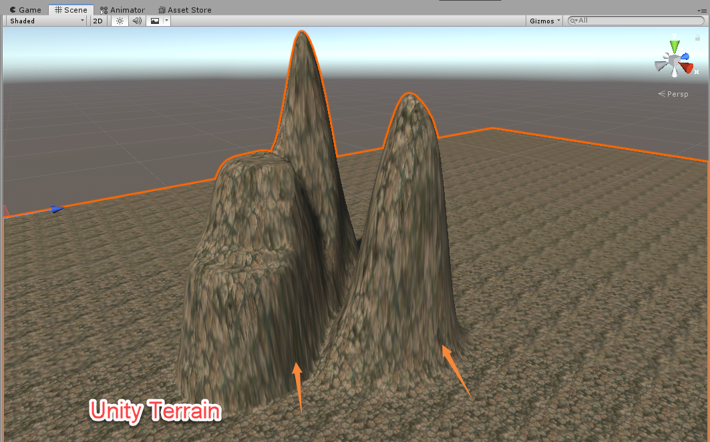

# TriplanarMapping

在基于高度图生成的地形中都会出现立面的纹理拉伸问题，Unity自带的地形系统同样会出现该问题。导致这个问题的原因也很简单：立面中所使用的UV只能跨越较小的纹理尺寸，进而导致了纹理的拉伸问题。

> http://transvoxel.org/Lengyel-VoxelTerrain.pdf
>
> http://www.cnblogs.com/cproom/archive/2006/08/07/470066.html
>
> https://medium.com/@bgolus/normal-mapping-for-a-triplanar-shader-10bf39dca05a
>
> https://github.com/bgolus/Normal-Mapping-for-a-Triplanar-Shader